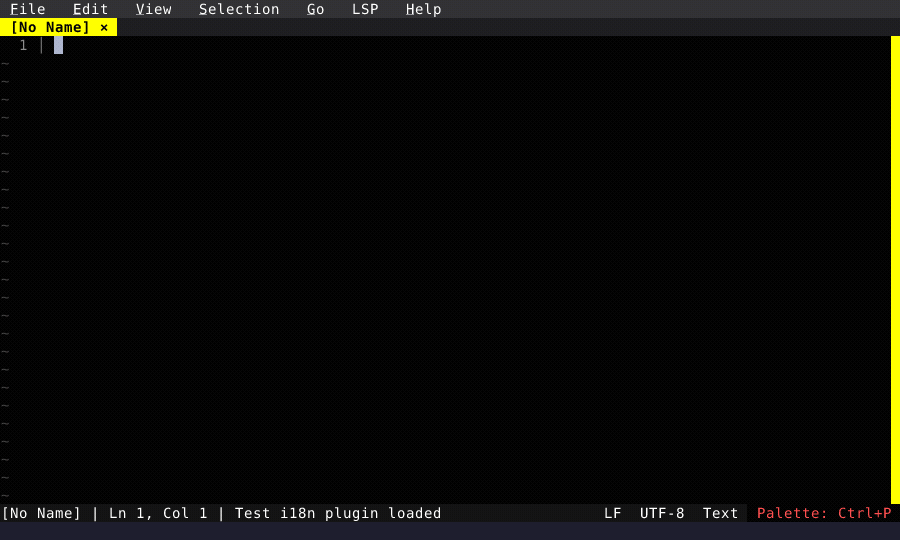
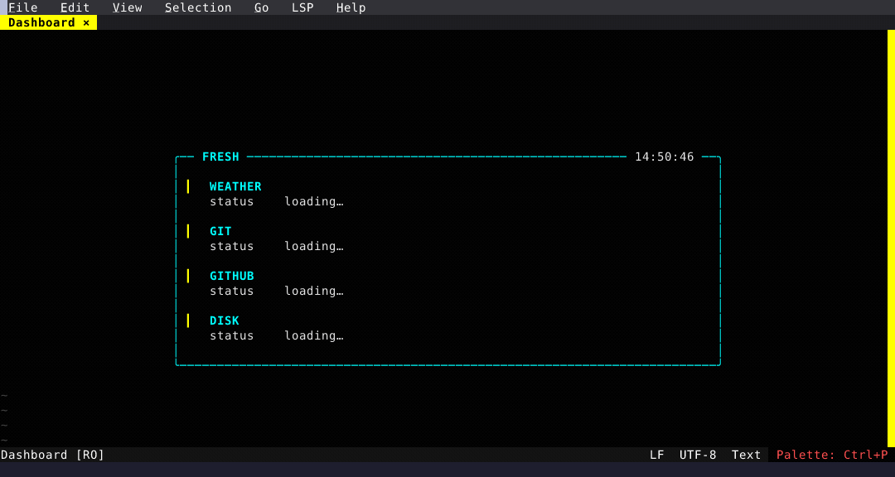
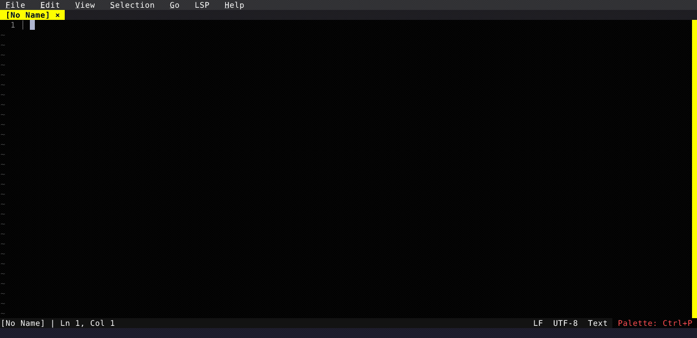
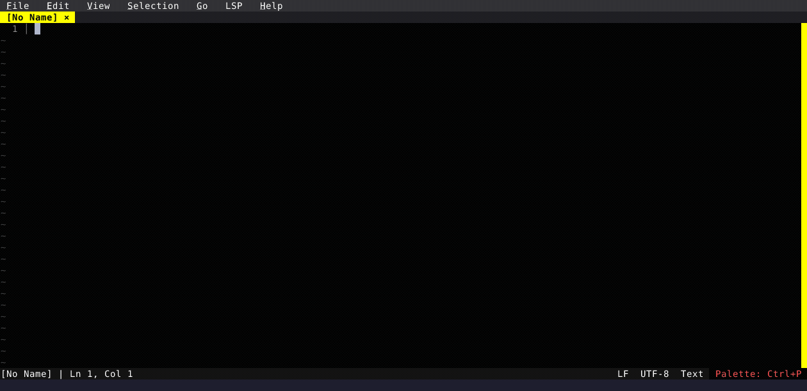

# What's New in Fresh (0.3.0)

*April 21, 2026*

A roundup of everything that landed since the [0.2.18 release](../fresh-0.2.18/) — eight point releases spanning a startup script, a TUI dashboard, devcontainer attach, a rewritten review diff and git log, preview tabs, customizable status bar, and a long tail of editor and LSP refinements.

## init.ts — a Startup Script

Fresh now auto-loads `~/.config/fresh/init.ts` on startup. Run **init: Edit** from the command palette to open it with a starter template, then **init: Reload** to re-run without restarting. It's TypeScript with the full plugin API, and it complements the declarative config — things like "calmer UI over SSH" or "use this rust-analyzer path on my work laptop" live here because they depend on where Fresh is starting, not on the shared config.

See the [Startup Script guide](/configuration/init) for the full picture.

  

## Dashboard

A built-in TUI dashboard replaces the default `[No Name]` buffer with weather info, git status + repo URL, a "vs master" commits-ahead/behind row, open GitHub PRs for the current repo, and disk usage for common mounts. Enable it via `plugins.dashboard.enabled` in `config.json` or the Settings UI. Third-party plugins and your `init.ts` can contribute custom sections through the `registerSection()` API — see the [Dashboard feature page](/features/dashboard).

  

## Devcontainers

Projects with `.devcontainer/devcontainer.json` get **Dev Container: Attach** and **Dev Container: Rebuild** in the command palette, plus an attach prompt on launch. While attached, the embedded terminal, filesystem, and any process Fresh spawns all run inside the container. Requires the [devcontainer CLI](https://github.com/devcontainers/cli). See [Devcontainers](/features/devcontainer).

## Review Diff Rewrite

The review diff view is now a single unified buffer: file list at the top, hunks below, all scrollable together. Use **`n`** / **`p`** to jump between hunks. Stage, unstage, or discard on the cursor row — hunk, whole file, or a line-level visual selection. Review comments now persist per repository across sessions, and a dedicated Comments panel makes them navigable. New entry points: **Review: Commit Range** for any range expression and **Review: PR Branch** for walking a branch's commits with a live side-by-side view.

  

## Git Log

**Git Log** opens a live-preview view — moving through the log updates the right panel with the selected commit's diff. Columns are aligned, messages wrap, and the toolbar is clickable.

  

## Preview Tabs in File Explorer

Single-clicking a file in the explorer now opens it in an ephemeral *preview* tab. The next single-click replaces that preview instead of accumulating tabs. Any real commitment — editing, double-clicking, pressing Enter, clicking the tab, or a layout action — promotes it to a permanent tab. On by default; turn off in the Settings UI if you prefer the old behavior.

  

## Customizable Status Bar

The left and right sides of the status bar are now configurable through the Settings UI. Items move between **Available** and **Included** columns using a DualList picker, and the arrow buttons let you reorder. A new `{clock}` element shows `HH:MM` with a blinking colon.

## Also New

### Editing

- **Buffer-word completions** without an LSP — words from your open buffers appear in the completion popup below any LSP results. Works everywhere, including in plain text and languages without a configured server.
- **LSP code actions** now fully work — quick fixes, refactors, rename/create/delete-file workspace edits, all merged into a single popup when multiple servers are configured.
- **PageUp/PageDown** is view-row-aware in wrapped buffers with a 3-row overlap between pages.
- **Find Next** now centers off-screen matches vertically so you keep context above and below.

### Themes and UI

- `theme` in `config.json` accepts relative paths (`"my-theme.json"`), `file://` with `${HOME}` / `${XDG_CONFIG_HOME}` expansion, and URL-packaged themes (`https://.../#theme`) — convenient for sharing config via dotfiles. See [Themes](/features/themes).
- Adaptive line-number gutter sized to the actual buffer.
- Markdown tables render with full box borders in Page View.

### LSP

- Single `LSP` status-bar indicator that opens a popup with per-server status, progress, restart/stop/log actions, and a "binary not in PATH" label so missing servers don't silently keep failing.
- Multiple servers per language with `only_features` / `except_features` filters, merged completions, per-server diagnostics.
- `root_markers` for per-language workspace root detection.
- Hover fuses any overlapping diagnostic (severity-coloured, source-tagged) above the hover body.
- `.h` files route to C++ when there's a clear signal (sibling `.cpp`/`.hpp`/`.hxx`).

### Configuration

- `default_language` — set a fallback language config for unrecognized file types (`{ "default_language": "bash" }`).
- Grammar short-name aliases — use `"bash"` instead of `"Bourne Again Shell (bash)"` in language configs.
- Per-language `line_wrap`, `wrap_column`, `page_view`, and `page_width` — wrap Markdown at 80 while leaving code unwrapped.
- New settings: `show_tilde`, `menu_bar_mnemonics`. Create-dirs-on-save. Customizable status bar.

### Remote

- `fresh ssh://user@host:port/path` on the CLI — the URL form now works as a launch argument, not just inside the editor.
- Background auto-reconnect with a disconnected indicator; filesystem calls no longer block the event loop; file finder (`Ctrl+P`) works on remote filesystems.
- File explorer in remote mode starts at the provided remote path instead of `~`.

### Plugin API

- `editor.overrideThemeColors(...)` for in-memory theme mutation.
- `editor.parseJsonc(...)` for host-side JSONC parsing.
- `editor.setAuthority` / `clearAuthority` / `spawnHostProcess` — the same Authority abstraction that powers SSH and devcontainers, exposed to plugins.
- Plugin-created terminals now follow the lifetime of the action that spawned them.
- `mouse_click` hook payload carries buffer coordinates; virtual lines accept theme keys and follow theme changes live.

### Quality of Life

- **Redraw Screen** palette command to repaint when something outside Fresh scribbles over the TUI.
- Terminal window title tracks the active buffer's filename.
- Read-only state persists across sessions.
- Narrow-terminal status bar drops low-priority elements in order so filename and cursor stay visible.
- Settings UI: deep search walks into Map entries and nested values; Inherit/Unset support for nullable settings.
- Keybinding Editor: special keys (Esc, Tab, Enter) can now be captured — press Enter on the key field, press the key you want, press Escape to cancel.
- Windows-1251 encoding; detection is heuristic, so reload with encoding if it guesses wrong.

## Related

- [Full changelog](https://github.com/sinelaw/fresh/blob/master/CHANGELOG.md)
- [All features](/features/)
- [Getting started](/getting-started/)
