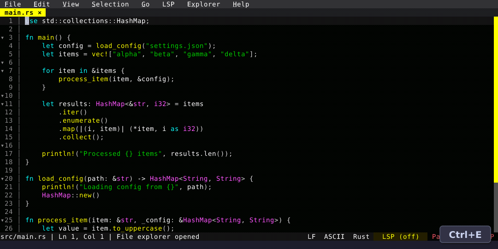

# Preview Tabs

Single-click opens a file in a preview tab that the next single-click replaces. Editing, double-click, Enter, or clicking the tab promotes it to a permanent tab.

  

Learn more: [File Explorer feature page](/features/file-explorer).

<!-- Generated by: cargo test --package fresh-editor --test e2e_tests blog_showcase_fresh-0.3.0/preview-tabs -- --ignored -->
<!-- Then run: scripts/frames-to-gif.sh docs/blog/fresh-0.3.0/preview-tabs -->
