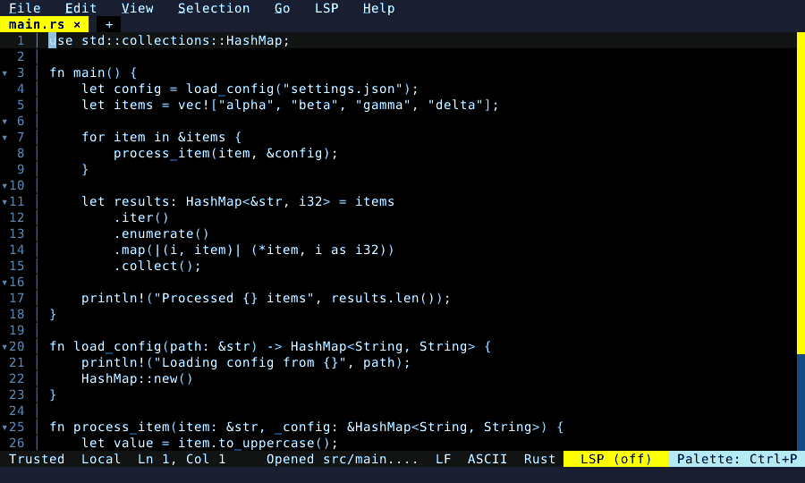

# What's New in Fresh (0.4.0)

*Draft — rolling up everything since the [0.3.0 release](../fresh-0.3.0/).*

A dozen point releases since 0.3.0, and the through-line is **working across many sessions and machines from one Fresh process**: a multi-window Orchestrator with a persistent dock, remote sessions you start from the UI, and a universal search that spans files, buffers, and terminals. Plus a reimagined review diff, live diff, terminal path links, environment managers, and the usual long tail of editor, LSP, and language work.

## The Orchestrator & Dock

Fresh can now juggle several independent sessions in one process. The **Orchestrator Dock** is a persistent, non-modal left column that lists every session — each row showing working/idle status, project, branch, a git summary, and a PR badge. `Alt+O` toggles focus to the dock; the arrow keys *live-switch* the active session as you move; right-click a row for Visit / Archive / Delete. Spin up new sessions from the **New Session** dialog (a type selector for Local / SSH / Kubernetes / Devcontainer), attach to existing git worktrees, or run bulk actions across a multi-select.

Every session keeps running on its own — in the demo below, two of them each run a (fake) coding agent in a terminal while a third holds a file explorer open. Bounce between the two agents and each has kept working: new log lines have streamed in and the spinner is still turning, captured mid-stride.

  

## Remote Sessions from the UI

You could already launch a remote host from the CLI; now the **New Session** dialog attaches one for you. Pick the **SSH** backend, point it at a host — `host`, `user@host:port`, or `ssh://…`, with an optional identity file and extra ssh options — and Fresh brings up a full remote session: the filesystem, LSP, process spawners, and an integrated terminal all run on the remote host. Switching sessions retargets without a restart. An initial, experimental **Kubernetes** backend connects over `kubectl exec` with a keepalive heartbeat and reconnect.

  

See [Remote Editing over SSH](/features/ssh).

## Universal Search

Live Grep grew into a universal search overlay: search across multiple **scopes** — project files, open **Buffers**, and **Terminal** scrollback — in **Word** or **Regex** mode, with a clickable toolbar and a live, syntax-highlighted preview on the right. **Resume** reopens the last query with cached results, and **Export to Quickfix** drops the hits into a dockable list you can navigate with Enter.

  

## Review Diff, Reimagined

The review diff picked up a real review workflow: a **file sidebar** grouped by directory with status, line counts, and comment badges; a true **side-by-side** view with `Tab` between the OLD/HEAD and NEW/working panes (and `Enter` to open either version at that line); **comments anywhere**, including multi-line notes rendered as inline callouts and collected in a dedicated panel; **Review Stash** to review a git stash as a diff; and a **watch mode** that auto-reloads on save. A `/` filter and split/stack/auto layout toggles round it out.

## Live Diff

The experimental **Live Diff** plugin overlays a unified diff *inside the editable buffer* and keeps it current as the file changes — pick a reference (`vs HEAD`, `vs Disk`, `vs Branch…`) and watch edits land in real time. Especially handy for watching an agent rewrite a file under you.

## Terminal Path Links

Run a build, a test, or a `grep` in the integrated terminal and **`Ctrl+Click`** (or `Ctrl+hover`) any `path:line` in the output — including in scrollback — to jump straight to that file and line. Fresh also tracks the shell's working directory via OSC 7 so relative paths resolve correctly.

## Environment Managers

A built-in **environment-manager** plugin detects a project's `venv` / `.envrc` (direnv) / `mise` setup and, via **Env: Activate**, injects that environment into *every* process Fresh spawns — LSP servers, formatters, terminals, and plugin subprocesses — with an opt-in `env` status-bar element. Activation is on-demand and respects Workspace Trust.

## Go to LSP Symbol

A symbol finder with live preview: filter your document's symbols, see source-line snippets, and jump precisely to the symbol name (line *and* column), with the symbol under the cursor preselected.

## Wave Screensaver

Pure eye-candy: leave the editor idle and a decorative **wave** washes over it — a rising sea of glyphs that bounces every cell (text, gutter, chrome) up, down, and sideways, with words launching off the crest and sinking back, before the UI settles intact. It runs as a screensaver after `screensaver_idle_minutes`, or fire it any time with the **Wave Animation** command.

  

## Also New

### Editing & Navigation

- **Rainbow bracket colorization** for matching brackets across the viewport.
- **Occurrence highlighting** toggle for the word under the cursor.
- **Distribute clipboard across cursors** — VS Code-style column-mode paste when the clipboard line count matches the cursor count.
- **Add Cursors to Line Ends**, **Move to Next / Previous Paragraph**, and **Go to line with selection**.
- **User-configurable indentation rules** — VS Code-style regex tiers via `[languages.<id>.indent]`.

### Terminal

- **Tab auto-naming** that follows the foreground process and OSC title.
- Scrollback survives resize, `clear`, and alternate-screen programs, and soft-wraps long lines.
- Nested `fresh` launches (`$EDITOR`, `git commit`) open in the parent editor instead of a second one.
- A **`+` new-tab button** on the tab bar (New Terminal / New File).

### File Explorer

- **Compact directories** (`com.example.name`, VS Code/IntelliJ-style), **follow-active-buffer**, natural-order filename sort, and context-menu **Duplicate** / **Copy (Relative) Path**.

### Settings & Themes

- Settings UI overhaul: **tree-view categories**, **direct number typing**, inline list editing, and **`Ctrl+R`** to reset a field to its default.
- **Theme inheritance** with `extends: "builtin://dark"`, plus a new **`terminal`** theme that uses your terminal's own palette.
- **Animations** framework — tab-switch slide and a cursor-jump trail (toggleable).

### Platform & Plugins

- **Workspace Trust** groundwork — a per-project trust level and a `workspaceTrustLevel()` plugin API.
- **LSP over SSH** runs the language server on the remote host.
- Status-bar element registration API (`git_statusbar`), `tab_actions`, plugin-registered config items, overlay toolbar widgets, and `editor.httpFetch`.
- A **minimal static musl** Linux binary, and an ~18 MB smaller default binary from trimming bundled grammars.

### New Languages

C3, Templ, HDL (Verilog / SystemVerilog / VHDL), Racket, and GDScript.

## Related

- [Full changelog](https://github.com/sinelaw/fresh/blob/master/CHANGELOG.md)
- [All features](/features/)
- [Getting started](/getting-started/)
